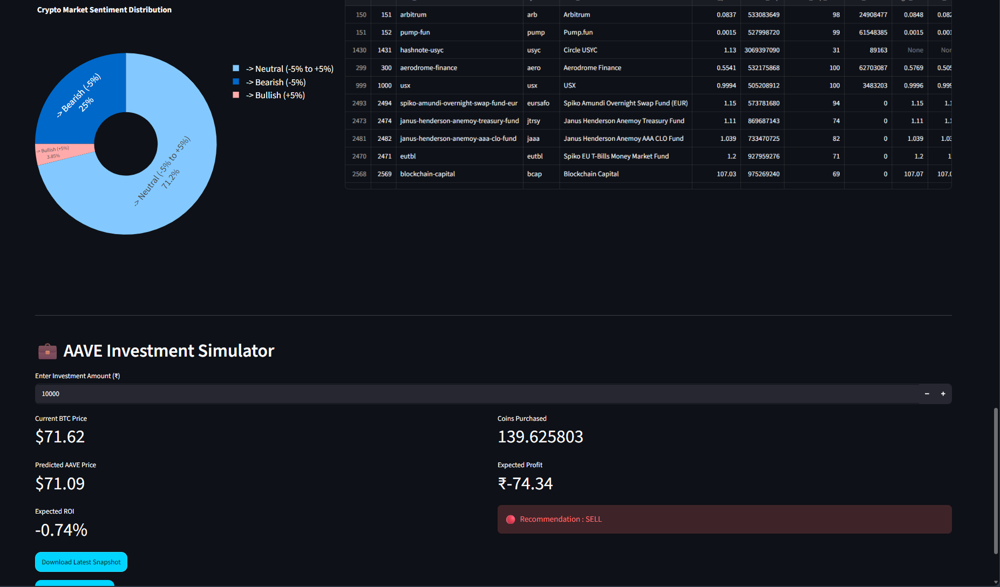
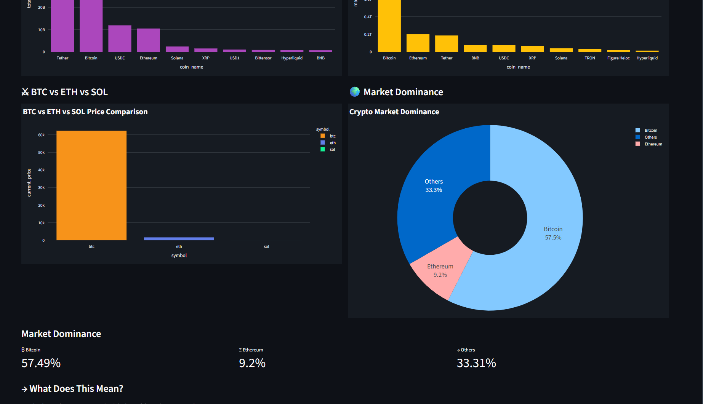

# Python

# Virtual Environment

venv/
env/

# IDE
.vscode/
# Streamlit
.streamlit/

# Environment
.env

# Logs
*.log

# Jupyter
.ipynb_checkpoints/

# Python cache
.pytest_cache/

# Build
build/

CryptoPulse Banner

Overview

Features

Tech Stack

Architecture Diagram

Project Structure

Machine Learning Pipeline

Dashboard Screenshots

Installation

Run Commands

Future Improvements

Author

License

CoinFlow
│
├── dashboard/
│   └── app.py
│
├── pipeline/
│
├── analytics/
│
├── ml/
│
├── utils/
│
├── config/
│
├── assets/
│   ├── dashboard.png
│   ├── prediction.png
│   ├── investment.png
│   └── sentiment.png
│
├── requirements.txt
├── README.md
├── LICENSE
├── .gitignore
└── runtime.txt

to run the project - python -m streamlit run dashboard/app.py